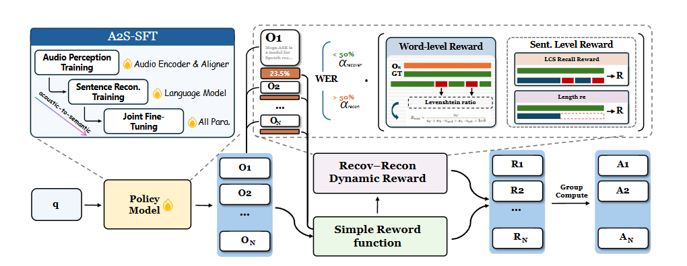
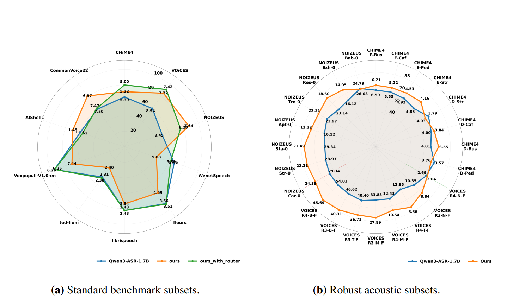
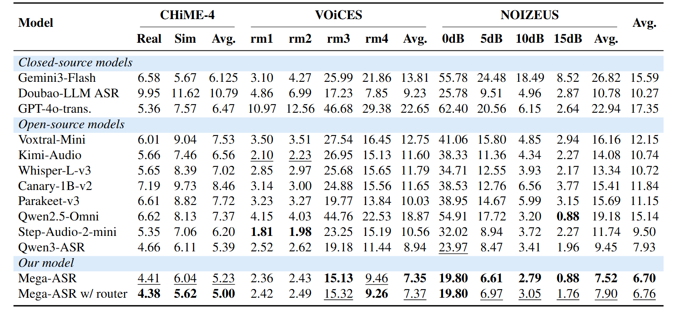
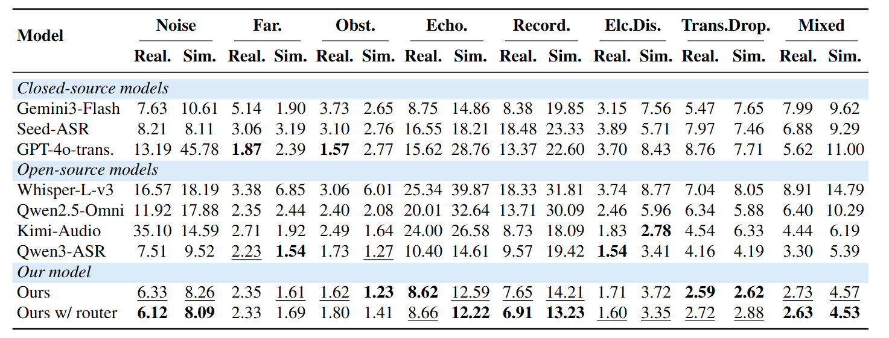
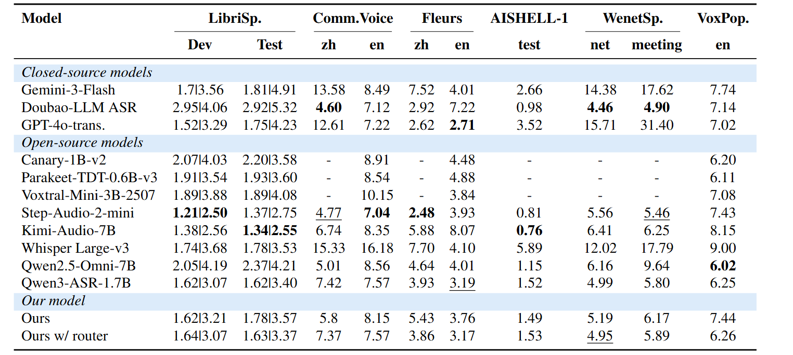

<p align="center">
  
</p>

<h1 align="center">Mega-ASR: Towards In-the-Wild Speech Recognition</h1>

<p align="center">
  <b>Robust Automatic Speech Recognition for Complex Real-World Acoustic Scenarios</b>
</p>

<p align="center">
  <a href="https://xzf-thu.github.io/Mega-ASR/"><b>Homepage</b></a> |
  <a href="#model-download"><b>Model Download</b></a> |
  <a href="#installation"><b>Our Bench Download</b></a> |
  <a href="#paper"><b>Paper</b></a> |
</p>

<p align="center">
  <a href="https://xzf-thu.github.io/Mega-ASR/">
    
  </a>
  
  
  
  
</p>


## 🔥🔥🔥 News!!

- **May 20, 2025**: 🔥 We release **Mega-ASR**. Model weights on Hugging Face are coming soon.
- **May 20, 2025**: 🔥 We release **Voices-in-the-Wild-2M**, a benchmark for in-the-wild ASR robustness evaluation. [[Dataset]](https://huggingface.co/datasets/zhifeixie/Voices-in-the-Wild-test-v2)
- **Coming soon**: 🔥 We will release the **DAPO-LoRA training code**.

## Contents

- [Introduction](#introduction)
- [Model Download](#model-download)
- [Main Results](#main-results)
- [Project Structure](#project-structure)
- [Quick Start](#quick-start)
- [Inference](#inference)
- [Finetune](#finetune)
- [Evaluation](#evaluation)


## Introduction


Mega-ASR is designed for speech recognition in complex real-world acoustic environments, where speech signals are often affected by noise, reverberation, far-field recording, low volume, distortion, stuttering, echo, obstruction, and multiple overlapping interferences. Unlike general-purpose ASR systems that mainly perform well on clean or moderately noisy speech, Mega-ASR focuses on medium- and high-error-rate audio conditions, where recognition stability becomes more challenging.

To improve robustness, Mega-ASR is built with large-scale dirty speech data and a two-stage robustness training pipeline. The released resources include model weights, core training data, evaluation benchmarks, and WER/CER evaluation scripts, enabling reproducible research and further development of robust ASR systems for in-the-wild scenarios.

### Highlights

- **Robust dirty and general ASR**: supports stable recognition for both in-the-wild dirty speech and general audio.
- **2M-scale dirty speech corpus**: covers noise, far-field recording, distortion, stuttering, echo, obstruction, and mixed acoustic interference.
- **SFT + RL robustness training**: improves recognition stability under complex acoustic conditions through supervised fine-tuning and reinforcement learning.
- **Reproducible WER/CER evaluation**: provides standard scripts and benchmarks for ASR robustness evaluation.
- **DAPO-LoRA roadmap**: reinforcement learning training code will be released in a future update.


## Model Download

We provide two Mega-ASR model variants for different usage scenarios.

| Model | Description | Download |
|---|---|---|
| **Mega-ASR for Dirty** | Optimized for dirty speech scenarios, including noisy, far-field, low-volume, degraded, and hard-to-recognize audio. | Coming soon |
| **Mega-ASR for All** | Built upon Mega-ASR for Dirty with a lightweight routing module that automatically distinguishes clean speech from degraded speech and selects the appropriate recognition path. | Coming soon |

After downloading the model weights, please specify the model path in the corresponding inference script or pass it through command-line arguments.


## Project Structure


<p align="center">
  
</p>

<p align="center">
  <b>Figure 1.</b> Overview of the Mega-ASR training pipeline, including acoustic-to-speech supervised fine-tuning and reward-based optimization for robust speech recognition.
</p>

```text
Mega-ASR/
├─ assets/
│  └─ Figures, logos, and other README resources.
│
├─ configs/
│  └─ Configuration files for SFT-LoRA and DAPO-LoRA training.
│
├─ data/
│  └─ Local data directory. Large-scale audio data is not tracked by Git.
│
├─ eval/
│  └─ evaluate_wer.py
│     WER/CER evaluation utilities for ASR robustness testing.
│
└─ src_MegaASR/
   ├─ inference/
   │  ├─ inference_MegaASR_for_dirty.py
   │  │  Dirty-speech inference without routing, designed for degraded audio.
   │  │
   │  └─ inference_MegaASR_for_all.py
   │     General inference with routing, supporting both dirty and general audio.
   │
   └─ train/
      ├─ SFT_lora/
      │  └─ SFT_lora.py
      │     SFT-LoRA training pipeline for acoustic robustness adaptation.
      │
      └─ DAPO_lora/
         └─ DAPO-LoRA training module, to be released in a future update.
```

## Main Results

Mega-ASR is evaluated across three benchmark families, including noisy and robust ASR benchmarks, Voices-in-the-Wild-Bench, and standard ASR benchmarks. Lower WER/CER indicates better recognition performance.

<p align="center">
  
</p>

<p align="center">
  <b>Figure 2.</b> Radar comparison of Qwen3-ASR-1.7B and Mega-ASR across selected ASR evaluation subsets.
</p>

### Noisy and Robust ASR Benchmarks

<p align="center">
  
</p>

<p align="center">
  <b>Table 1.</b> Performance comparison on noisy and robust ASR benchmarks.
</p>

### Voices-in-the-Wild-Bench

<p align="center">
  
</p>

<p align="center">
  <b>Table 2.</b> Breakdown results on Voices-in-the-Wild-Bench by acoustic scenario.
</p>

### Standard ASR Benchmarks

<p align="center">
  
</p>

<p align="center">
  <b>Table 3.</b> Performance comparison on standard ASR benchmarks. For LibriSpeech, each entry is reported as clean/other.
</p>

## Quick Start

### 1. Create Environment

We recommend using Conda to create an isolated Python environment.

```bash
conda create -n mega-asr2 python=3.12 -y
conda activate mega-asr2
```

Upgrade basic Python build tools:

```bash
python -m pip install --upgrade pip setuptools wheel
```

### 2. Install PyTorch

Install PyTorch with CUDA 12.8 support:

```bash
pip install \
  torch==2.9.1+cu128 \
  torchaudio==2.9.1+cu128 \
  torchvision==0.24.1+cu128 \
  --index-url https://download.pytorch.org/whl/cu128
```

### 3. Install Mega-ASR Dependencies

```bash
pip install -r mega_asr_requirements.txt
```

### 4. Install Qwen3-ASR Dependency

Mega-ASR is built upon Qwen3-ASR. Please prepare the Qwen3-ASR source code locally and install it in editable mode:

```bash
pip install -e /path/to/Qwen3-ASR --no-deps
```

For example, replace `/path/to/Qwen3-ASR` with the actual local path of your Qwen3-ASR repository.

## Inference

### Inference for Dirty Audio

```bash
python src_MegaASR/inference/inference_MegaASR_for_dirty.py \
  --audio path/to/audio.wav \
  --model_path path/to/model
```

### Inference for General Audio

```bash
python src_MegaASR/inference/inference_MegaASR_for_all.py \
  --audio path/to/audio.wav \
  --model_path path/to/model
```

## Evaluation

```bash
python eval/evaluate_wer.py \
  --pred predictions.jsonl \
  --ref references.jsonl
```


## Finetune

Mega-ASR provides fine-tuning support for acoustic robustness adaptation, including supervised fine-tuning and reinforcement learning based training.

### SFT-LoRA Training

The SFT-LoRA pipeline is provided under `src_MegaASR/train/SFT_lora/`. It is used to adapt the model to complex dirty speech scenarios with supervised training data.

```bash
python src_MegaASR/train/SFT_lora/SFT_lora.py \
  --config configs/sft_lora.yaml
```
### DAPO-LoRA Training

The DAPO-LoRA training module is under active research and will be released in a future version.

## Evaluation

We provide standard WER/CER evaluation utilities for ASR robustness testing.

```bash
python eval/evaluate_wer.py \
  --pred predictions.jsonl \
  --ref references.jsonl
```

## Roadmap

- [x] Repository structure
- [ ] Inference for dirty audio
- [ ] Inference for general audio
- [ ] WER evaluation
- [ ] SFT-LoRA training
- [ ] Model checkpoint release
- [ ] DAPO-LoRA release

## Citation

If you find this project useful, please consider citing our work. Citation information will be updated after the release of the paper.

## License

This project will be released under the Apache-2.0 License.